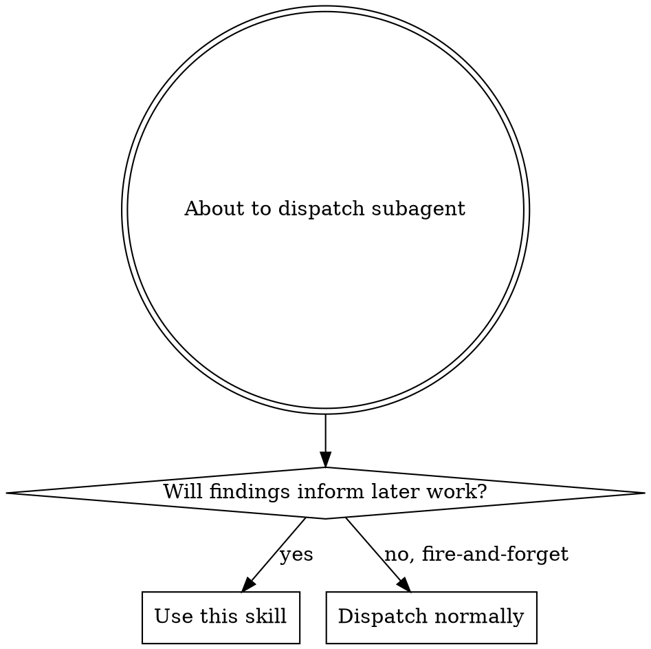
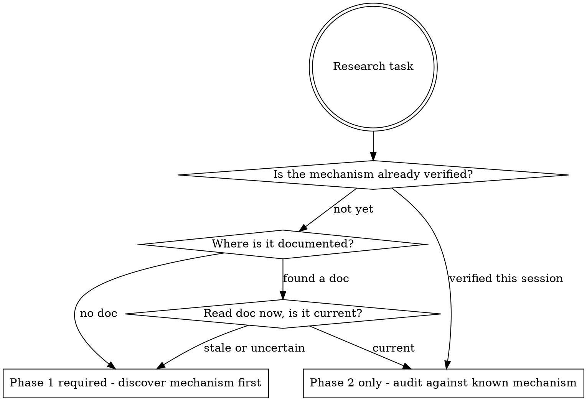

# Research Dispatch

**This is a rigid skill. Do not adapt, abbreviate, or skip steps.**

## Overview

Subagent research fails when the parent agent prescribes *what to search for* instead of
*what to find out*. Unverified names, annotations, and identifiers in prompts become
fabricated ground truth that subagents dutifully confirm or deny without questioning.

**Core principle:** The parent agent's job is to frame questions. The subagent's job is to
discover answers. Never cross that boundary.

## When to Use



**Use for:** Any subagent whose output will be cited, acted on, or used as input to
implementation, design docs, or further research.

**Skip for:** Mechanical edits with known targets (rename variable X to Y), formatting,
tasks where incorrect output is immediately obvious.

## Steps - Execute Before Every Research Dispatch

### Step 1: List All Search Targets

Scan every subagent prompt you're about to send. Extract every specific identifier:
class names, annotation names, config keys, file paths, API endpoints, system behavior
claims.

Write them down explicitly. If there are none, the prompts are goal-oriented - skip to
Step 4.

### Step 2: Verify Each Target

For each identifier from Step 1, answer: **How do I know this exists?**

| Evidence | Verdict |
|----------|---------|
| I read it in source code this session | Verified |
| A subagent returned it this session | Verified |
| A current project doc describes it and I read the doc this session | Verified |
| I remember it from a previous session | **Unverified** |
| It's probably called something like this | **Unverified** |
| It's a reasonable guess based on conventions | **Unverified** |
| I saw it in a different system and assume this one is similar | **Unverified** |

**If any target is unverified, you must not include it in the subagent prompt.**

### Step 3: Classify Tasks by Ground Truth

For each research task, determine whether ground truth exists:



### Step 4: Select Agent Type

For each task, select the agent based on what knowledge is needed:

- **Internal system behavior at your organization** (proprietary RPC frameworks,
  auth systems, internal services): Use whichever agent has the richest discovery
  tools for your environment — typically one with access to internal docs search,
  one-pager lookup, and source-code search.
- **Codebase structure or file location**: Use `Explore`.
- **Local file reads/edits with no discovery needed**: Use generic agent.
- **Uncertain**: Default to the agent with the richest discovery tools for the domain.

### Step 5: Produce Dispatch Plan

Before writing any Agent tool calls, produce a dispatch plan. Present it to yourself
(not the user) as a structured checklist:

```
## Dispatch Plan

### Phase 1 (must complete before Phase 2)
- Task: [goal-oriented description]
  Agent type: [docs-search/Explore/generic]
  Why Phase 1: [what ground truth is missing]

### Phase 2 (can parallelize after Phase 1)
- Task: [goal-oriented description]
  Agent type: [type]
  Ground truth source: [doc read, Phase 1 output, or session finding]

### Direct dispatch (no phasing needed)
- Task: [goal-oriented description]
  Agent type: [type]
  Verified targets: [list with evidence]
```

If all tasks are Phase 2 or direct, they can all dispatch in parallel.
If any tasks are Phase 1, those must complete before their dependent Phase 2 tasks.

### Step 6: Prompt Construction Rules

When writing each subagent prompt:

1. **State the goal, not the search.** "Determine how X restricts Y" not "Search for
   `@RestrictY` in X."
2. **Include self-validation instructions.** Append to every research prompt:
   "If you search for something and don't find it, do not conclude it's absent.
   Instead, verify you're searching for the right thing - check documentation,
   alternative names, and different locations before reporting a negative."
3. **Never include unverified identifiers.** If Step 2 flagged it, it doesn't go in
   the prompt. Describe the concept instead.

## Red Flags - If You Think Any of These, STOP

- "I'm pretty sure it's called `@Something`"
- "This is probably how that system works"
- "The subagent can figure out what I mean"
- "This is just a quick grep, it doesn't need the full process"
- "I already know the answer, I just need the subagent to confirm it"
- "Writing 6 careful prompts takes too long"
- "The targets are obvious from the domain conventions"

**All of these mean: you're about to prescribe a guess as ground truth.**

## Rationalization Table

| Excuse | Reality |
|--------|---------|
| "I know the annotation name" | If you haven't read it in source this session, you're guessing. Guesses become fabricated evidence. |
| "Generic agents can grep just as well" | They can grep, but they can't discover mechanisms they don't know about. Use the agent with the right discovery tools. |
| "We searched and didn't find it, so it's absent" | You searched for something that might not exist. Absence of a phantom is not evidence. |
| "6 prompts need to go out fast for parallelism" | Wrong research is worse than slow research. Every prompt that poisons downstream work wastes more time than careful construction saves. |
| "This is a simple lookup, not research" | If "not found" would be treated as a conclusion, it's research. Apply the skill. |
| "I'll verify the results when they come back" | You won't. Under the same throughput pressure that made you skip prompt review, you'll accept plausible-sounding results uncritically. |
